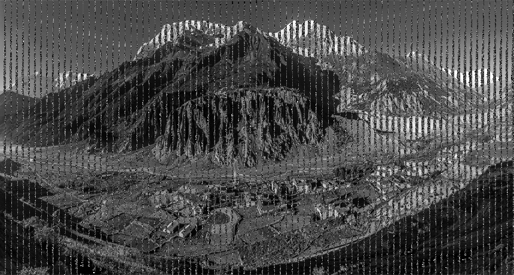

# Arithmetic encoder and decoder in python

## implementing the finite intger precision arithmetic encoder/decoder in python

i made the integer arithmetic coding to handle finite precision, and it will encode and decode image in grayscale not RGB 

## Encoding 

### install the required dependencies
> pip install opencv-python 
> pip install numpy 
> pip install matplotlib 

### run encode.py file
> python encode.py

### enter the image you would like to encode eg :
>  img1.jpg

### enter block size to be encoded eg:
> 10

### enter the precision you want eg : 
> 63

the code will run for a while and will then generate 2 ".npy" files, the "code.npy" file contain the arithmetic code, the second "limits.npy" file will contain the cummulative sum of frequencies of pixel images that appear in image (no need to worry about it just give it to the decoder so it can decode the image correctly :) )
 
## Decoding 

### run decode.py file
> python decode.py

### enter arithmetic code file path that was outputted from encode script :
>  code.npy

### enter limits  file path that was outputted from encode script:
> limits.npy

### enter the image first dimension eg : 
> 460

### enter the image second dimension eg : 
> 860

### enter block size used for encoding eg:
> 10

### enter the precision user for encoding eg : 
> 63

then decoder will output the decoded image as decoded.jpg 

## the demo shown above 
### the original image

### the decoded image (with smaller block size it will get much better)

  
##### ps: for large images you might want to give it some time, main.py contain my naive floating point implementation 
